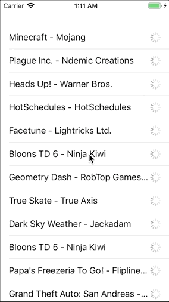
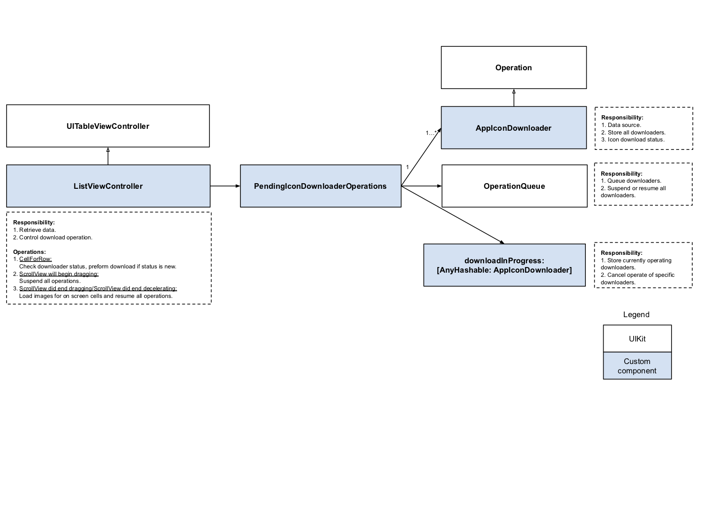

# LazyLoading

## Screenshot

## HighLevel architecture

Demo about table view image lazy loading implemented by Operations, inspired by [LazyTableImages](https://developer.apple.com/library/archive/samplecode/LazyTableImages/Introduction/Intro.html#//apple_ref/doc/uid/DTS40009394-Intro-DontLinkElementID_2) and [operationqueue-tutorial](https://www.raywenderlich.com/5293-operation-and-operationqueue-tutorial-in-swift) 

# Operations
## Operation
[Operation](https://developer.apple.com/documentation/foundation/operation) is a high level API based on GCD that has some advance features like **cancel**, **suspend**, and **resume**.
Operation only can perform once and cannot be execute again.
We usually put operations into operationqueu but you can manually trigger operation by calling its `start()` method and you will take care the readiness state.
## OperationQueue
An [OperationQueue](https://developer.apple.com/documentation/foundation/operationqueue) executes its queued operations.

Author: [Wayne Hsiao](mailto:chronicqazxc@gmail.com)
